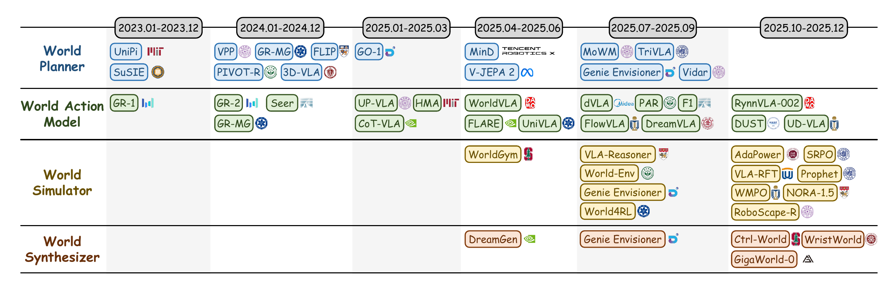
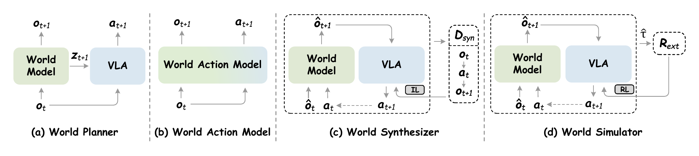

# Awesome World Models for VLA Agents

[](https://awesome.re)
[](https://opensource.org/licenses/MIT)
[](https://www.techrxiv.org/users/1019104/articles/1379248-towards-generalist-embodied-ai-a-survey-on-world-models-for-vla-agents)


> This is the official repository for the survey paper: [**Towards Generalist Embodied AI: A Survey on World Models for VLA Agents**](https://www.techrxiv.org/users/1019104/articles/1379248-towards-generalist-embodied-ai-a-survey-on-world-models-for-vla-agents).

## 🚩 News & Updates

*Major updates and announcements are shown below. Scroll for full timeline.*

🎉 **[2026-02] Repository Initialization** — Awesome World Models for VLA Agents repository is now live! This repository systematically organizes and tracks the latest resources in world models for VLA agents.

## 📝 Citation

If you find our survey or this repository helpful for your research, please consider citing our paper:

~~~bibtex
@article{WM_for_VLA_Survey,
  title={Towards Generalist Embodied AI: A Survey on World Models for VLA Agents},
  author={Tan, Wentao and Zhu, Lei and Wang, Bowen and Xie, Enci and Ji, Baixu and Lin, Zengrong and Yang, Wenjie and Li, Jingjing and Shen, Heng Tao},
  journal={TechRxiv preprint},
  year={2026},
  doi={10.36227/techrxiv.176948355.54623875/v1},
}
~~~

## 📌 Overview

To bridge the gap towards generalist embodied AI, this repository provides a structured landscape of **World Models for VLA Agents**. Rather than just listing papers, we organize the frontier research based on a novel taxonomy proposed in our survey, classifying the integration into four primary paradigms: **World Planner, World Action Model, World Synthesizer, and World Simulator**. Explore the curated resources, foundation models, evaluation metrics, and benchmarks through the directory below.

### 📑 Table of Contents

* [🗺️ Taxonomy](#-taxonomy)
* [📖 Research Papers](#-research-papers)
  * [1. World Planner](#1-world-planner)
  * [2. World Action Model](#2-world-action-model)
  * [3. World Simulator](#3-world-simulator)
  * [4. World Synthesizer](#4-world-synthesizer)
* [🧱 Foundation Models](#-foundation-models)
* [📊 Evaluation Metrics](#-evaluation-metrics)
* [🏆 Benchmarks](#-benchmarks)
* [🤝 Contributing](#-contributing)

## 🗺️ Taxonomy

<p align="center">
  <br>
  <em>Figure 2. Taxonomy of world models for VLA agents.</em><br><br>
  <br>
  <em>Figure 3. Four paradigms of world models for VLA agents. IL and RL denote imitation learning and reinforcement learning, respectively.</em>
</p>


* **World Planner**: Adopts the world model $\mathcal{W}_{\phi}$ as a forward dynamics model to synthesize future guidance in the form of explicit future observations or latent features, thereby providing semantic conditioning for the policy $\pi_{\theta}$:

  ```math
  \max_{\theta} \mathbb{E}_{\substack{\tau \sim \mathcal{D} \\ z_{t+1} \sim \mathcal{W}_{\phi}(\cdot|o_t)}} \left[ \sum_t \log \pi_{\theta}(a_{t+1} \mid o_t, z_{t+1}) \right].
  ```

* **World Action Model**: Employs generative modeling to approximate the joint distribution of future observations and actions, predicting the coupled dynamics of vision and control based on the given context:

  ```math
  \max_{\phi} \mathbb{E}_{\tau \sim \mathcal{D}} \left[ \sum_{t} \log \mathcal{W}_{\phi}(o_{t+1}, a_{t+1} \mid o_{t}) \right].
  ```

* **World Synthesizer**: Constructs a scalable data engine by synthesizing interleaved observation-action trajectories $\hat{\tau}$ via a joint generator $\mathcal{G}_{\theta,\phi}$ to support imitation learning:

  ```math
  \mathcal{D}_{\text{syn}} \triangleq \left\{ \hat{\tau} \sim p(o_{0}) \prod_{t} \mathcal{G}_{\theta,\phi}(\hat{o}_{t+1}, a_{t+1} \mid \hat{o}_{t}) \right\},
  ```
    
  where $\mathcal{G}_{\theta,\phi}$ factorizes according to the conditional dependence structure: (i) *Action-conditioned*: $\mathcal{G}_{\theta,\phi} = \mathcal{W}_{\phi}(\hat{o}_{t+1} \mid \hat{o}_{t}, a_{t})\pi_{\theta}(a_{t+1} \mid \hat{o}_{t+1})$, predicting observations conditioned on actions from a rollout policy $\pi_{\theta}$; (ii) *Action-free*: $\mathcal{G}_{\theta,\phi} = \mathcal{W}_{\phi}(\hat{o}_{t+1} \mid \hat{o}_{t})\mathcal{I}_{\psi}(a_{t+1} \mid \hat{o}_{t}, \hat{o}_{t+1})$, where inverse dynamics $\mathcal{I}_{\psi}$ infers actions from visual trajectories generated by $\mathcal{W}_{\phi}$.

* **World Simulator**: Uses the action-conditioned world model $\mathcal{W}_{\phi}$ as a virtual simulator to generate synthetic future states. By integrating with external reward evaluators, it enables policy improvement by optimizing the expected reward on imagined outcomes:

  ```math
  \max_{\theta} \mathbb{E}_{\substack{a \sim \pi_{\theta}(\cdot|o) \\ \hat{o} \sim \mathcal{W}_{\phi}(\cdot|o,a)}} [\mathcal{R}_{\text{ext}}(\hat{o}, a)].
  ```

## 📖 Research Papers

> **Note:** Papers marked with ✨ are newly added to this repository and not present in the original survey paper.

### 1. World Planner

**Explicit Planning (Predicted Image)**
* **UniPi** - Learning Universal Policies via Text-Guided Video Generation. (2023) <a href="https://arxiv.org/abs/2302.00111"></a> 
* **SuSIE** - Zero-Shot Robotic Manipulation with Pretrained Image-Editing Diffusion Models. (2023) <a href="https://arxiv.org/abs/2310.10639"></a> <a href="https://github.com/kvablack/susie"></a>
* **3D-VLA** - 3D-VLA: A 3D Vision-Language-Action Generative World Model. (2024) <a href="https://arxiv.org/abs/2403.09631"></a> <a href="https://github.com/UMass-Embodied-AGI/3D-VLA"></a>
* **GR-MG** - GR-MG: Leveraging Partially Annotated Data via Multi-Modal Goal Conditioned Policy. (2024) <a href="https://arxiv.org/abs/2408.14368"></a> <a href="https://github.com/bytedance/GR-MG"></a>
* **FLIP** - FLIP: Flow-Centric Generative Planning as General-Purpose Manipulation World Model. (2025) <a href="https://arxiv.org/abs/2412.08261"></a> <a href="https://github.com/HeegerGao/FLIP"></a> 
* **Vidar** - Vidar: Embodied Video Diffusion Model for Generalist Manipulation. (2025) <a href="https://arxiv.org/abs/2507.12898"></a> <a href="https://github.com/thu-ml/vidar"></a>

**Implicit Planning (Embedding)**
* **PIVOT-R** - PIVOT-R: Primitive-Driven Waypoint-Aware World Model for Robotic Manipulation. (2024) <a href="https://arxiv.org/abs/2410.10394"></a> <a href="https://github.com/abliao/PIVOT-R"></a>
* **V-JEPA 2** - V-JEPA 2: Self-Supervised Video Models Enable Understanding, Prediction and Planning. (2025) <a href="https://arxiv.org/abs/2506.09985"></a> <a href="https://github.com/facebookresearch/vjepa2"></a>

**Explicit Planning (Embedding)**
* **VPP** - Video Prediction Policy: A Generalist Robot Policy with Predictive Visual Representations. (2024) <a href="https://arxiv.org/abs/2412.14803"></a> <a href="https://github.com/roboterax/video-prediction-policy"></a> 
* **GO-1** - AgiBot World Colosseo: A Large-Scale Manipulation Platform for Scalable and Intelligent Embodied Systems. (2025) <a href="https://arxiv.org/abs/2503.06669"></a> <a href="https://github.com/OpenDriveLab/AgiBot-World"></a>
* **MinD** - MinD: Learning A Dual-System World Model for Real-Time Planning and Implicit Risk Analysis. (2025) <a href="https://arxiv.org/abs/2506.18897"></a> <a href="https://github.com/manipulate-in-dream/MinD"></a> 
* **TriVLA** - TriVLA: A Triple-System-Based Unified Vision-Language-Action Model with Episodic World Modeling for General Robot Control. (2025) <a href="https://arxiv.org/abs/2507.01424"></a> 
* **Genie Envisioner** - Genie Envisioner: A Unified World Foundation Platform for Robotic Manipulation. (2025) <a href="https://arxiv.org/abs/2508.05635"></a> <a href="https://github.com/AgibotTech/Genie-Envisioner"></a>

**Hybrid Planning**
* **MoWM** - MoWM: Mixture-of-World-Models for Embodied Planning via Latent-to-Pixel Feature Modulation. (2025) <a href="https://arxiv.org/abs/2509.21797"></a> <a href="https://github.com/tsinghua-fib-lab/MoWM"></a>

### 2. World Action Model

**Autoregressive (Video Pretraining)**
* **GR-1** - Unleashing Large-Scale Video Generative Pre-Training for Visual Robot Manipulation. (2023) <a href="https://arxiv.org/abs/2312.13139"></a> <a href="https://github.com/bytedance/GR-1"></a>
* **GR-2** - GR-2: A Generative Video-Language-Action Model with Web-Scale Knowledge for Robot Manipulation. (2024) <a href="https://arxiv.org/abs/2410.06158"></a>
* **HMA** - Learning Real-World Action-Video Dynamics with Heterogeneous Masked Autoregression. (2025) <a href="https://arxiv.org/abs/2502.04296"></a> <a href="https://github.com/liruiw/HMA"></a> 
* **UniVLA** - Unified Vision-Language-Action Model. (2025) <a href="https://arxiv.org/abs/2506.19850"></a> <a href="https://github.com/baaivision/UniVLA"></a>

**Autoregressive (Unified Modeling)**
* **UP-VLA** - UP-VLA: A Unified Understanding and Prediction Model for Embodied Agent. (2025) <a href="https://arxiv.org/abs/2501.18867"></a> <a href="https://github.com/CladernyJorn/UP-VLA"></a> 
* **WorldVLA** - WorldVLA: Towards Autoregressive Action World Model. (2025) <a href="https://arxiv.org/abs/2506.21539"></a> <a href="https://github.com/alibaba-damo-academy/RynnVLA-002/tree/worldvla"></a> 
* **RynnVLA-002** - RynnVLA-002: A Unified Vision-Language-Action and World Model. (2025) <a href="https://arxiv.org/abs/2511.17502"></a> <a href="https://github.com/alibaba-damo-academy/RynnVLA-002"></a> 

**Autoregressive (Foresight)**
* **GR-MG** - GR-MG: Leveraging Partially Annotated Data via Multi-Modal Goal Conditioned Policy. (2025) <a href="https://arxiv.org/abs/2408.14368"></a> <a href="https://github.com/bytedance/GR-MG"></a>
* **Seer** - Predictive Inverse Dynamics Models are Scalable Learners for Robotic Manipulation. (2025) <a href="https://arxiv.org/abs/2412.15109"></a> <a href="https://github.com/InternRobotics/Seer"></a> 
* **PAR** - Physical Autoregressive Model for Robotic Manipulation Without Action Pretraining. (2025) <a href="https://arxiv.org/abs/2508.09822"></a> <a href="https://github.com/HCPLab-SYSU/PhysicalAutoregressiveModel"></a> 
* **F1** - F1: A Vision-Language-Action Model Bridging Understanding and Generation to Actions. (2025) <a href="https://arxiv.org/abs/2509.06951"></a> <a href="https://github.com/InternRobotics/F1-VLA"></a> 

**Autoregressive (Reasoning)**
* **CoT-VLA** - CoT-VLA: Visual Chain-of-Thought Reasoning for Vision-Language-Action Models. (2025) <a href="https://arxiv.org/abs/2503.22020"></a> 
* **DreamVLA** - DreamVLA: A Vision-Language-Action Model Dreamed with Comprehensive World Knowledge. (2025) <a href="https://arxiv.org/abs/2507.04447"></a> <a href="https://github.com/Zhangwenyao1/DreamVLA"></a> 
* **FlowVLA** - FlowVLA: Visual Chain-of-Thought-Based Motion Reasoning for Vision-Language-Action Models. (2025) <a href="https://arxiv.org/abs/2508.18269"></a> 

**Diffusion-based (Discrete Modeling)**
* **dVLA** - dVLA: Diffusion Vision-Language-Action Model with Multimodal Chain-of-Thought. (2025) <a href="https://arxiv.org/abs/2509.25681"></a> 
* **UD-VLA** - Unified Diffusion VLA: Vision-Language-Action Model via Joint Discrete Denoising Diffusion Process. (2025) <a href="https://arxiv.org/abs/2511.01718"></a> <a href="https://github.com/OpenHelix-Team/Unified-Diffusion-VLA"></a> 

**Diffusion-based (Real-valued Modeling)**
* **FLARE** - FLARE: Robot Learning with Implicit World Modeling. (2025) <a href="https://arxiv.org/abs/2505.15659"></a> 
* **DUST** - Dual-Stream Diffusion for World-Model Augmented Vision-Language-Action Model. (2025) <a href="https://arxiv.org/abs/2510.27607"></a>

### 3. World Synthesizer

**View Augmentation (Wrist-view Foresight)**
* **WristWorld** - WristWorld: Generating Wrist-Views via 4D World Models for Robotic Manipulation. (2025) <a href="https://arxiv.org/abs/2510.07313"></a> <a href="https://github.com/XuWuLingYu/WristWorld"></a>

**Generative Data Pipelines (Action-conditioned)**
* **Genie Envisioner** - Genie Envisioner: A Unified World Foundation Platform for Robotic Manipulation. (2025) <a href="https://arxiv.org/abs/2508.05635"></a> <a href="https://github.com/AgibotTech/Genie-Envisioner"></a>
* **Ctrl-World** - Ctrl-World: A Controllable Generative World Model for Robot Manipulation. (2025) <a href="https://arxiv.org/abs/2510.10125"></a> <a href="https://github.com/Robert-gyj/Ctrl-World"></a>

**Generative Data Pipelines (Action-free)**
* **DreamGen** - DreamGen: Unlocking Generalization in Robot Learning through Video World Models. (2025) <a href="https://arxiv.org/abs/2505.12705"></a> <a href="https://github.com/NVIDIA/GR00T-Dreams"></a>
* **GigaWorld-0** - GigaWorld-0: World Models as Data Engine to Empower Embodied AI. (2025) <a href="https://arxiv.org/abs/2511.19861"></a> <a href="https://github.com/open-gigaai/giga-world-0"></a>

### 4. World Simulator

**Evaluator (Task Success)**
* **WorldGym** - WorldGym: World Model as an Environment for Policy Evaluation. (2025) <a href="https://arxiv.org/abs/2506.00613"></a> <a href="https://github.com/world-model-eval/world-model-eval"></a>
* **Genie Envisioner** - Genie Envisioner: A Unified World Foundation Platform for Robotic Manipulation. (2025) <a href="https://arxiv.org/abs/2508.05635"></a> <a href="https://github.com/AgibotTech/Genie-Envisioner"></a>

**Reinforcement Learning (Sparse Reward)**
* **World4RL** - World4RL: Diffusion World Models for Policy Refinement with Reinforcement Learning for Robotic Manipulation. (2025) <a href="https://arxiv.org/abs/2509.19080"></a>
* **WMPO** - WMPO: World Model-Based Policy Optimization for Vision-Language-Action Models. (2025) <a href="https://arxiv.org/abs/2511.09515"></a> <a href="https://github.com/WM-PO/WMPO"></a>
* **Prophet** - Prophet: Reinforcing Action Policies by Prophesying. (2025) <a href="https://arxiv.org/abs/2511.20633"></a>

**Reinforcement Learning (Dense Reward)**
* **World-Env** - World-Env: Leveraging World Model as a Virtual Environment for VLA Post-Training. (2025) <a href="https://arxiv.org/abs/2509.24948"></a> <a href="https://github.com/amap-cvlab/world-env"></a>
* **VLA-RFT** - VLA-RFT: Vision-Language-Action Reinforcement Fine-Tuning with Verified Rewards in World Simulators. (2025) <a href="https://arxiv.org/abs/2510.00406"></a> <a href="https://github.com/OpenHelix-Team/VLA-RFT"></a>
* **NORA-1.5** - NORA-1.5: A Vision-Language-Action Model Trained Using World Model and Action-Based Preference Rewards. (2025) <a href="https://arxiv.org/abs/2511.14659"></a> <a href="https://github.com/declare-lab/nora-1.5"></a>
* **SRPO** - SRPO: Self-Referential Policy Optimization for Vision-Language-Action Models. (2025) <a href="https://arxiv.org/abs/2511.15605"></a> <a href="https://github.com/sii-research/siiRL"></a>
* **RoboScape-R** - RoboScape-R: Unified Reward-Observation World Models for Generalizable Robotics Training via RL. (2025) <a href="https://arxiv.org/abs/2512.03556"></a>

**Test-Time Adaptation**
* **VLA-Reasoner** - VLA-Reasoner: Empowering Vision-Language-Action Models with Reasoning via Online Monte Carlo Tree Search. (2025) <a href="https://arxiv.org/abs/2509.22643"></a>
* **AdaPower** - AdaPower: Specializing World Foundation Models for Predictive Manipulation. (2025) <a href="https://arxiv.org/abs/2512.03538"></a>

## 🧱 Foundation Models

Overview of foundation models serving as world models towards VLA systems. **Params.** denotes the model parameters. **Methods** lists representative applications utilizing these models.

| Model | Link | Params. | Methods |
| :--- | :--- | :--- | :--- |
| **Image/Video Generation Models** ||||
| iVideoGPT | <a href="https://github.com/thuml/iVideoGPT"></a> | 0.6B | VLA-RFT, VLA-Reasoner |
| NOVA | <a href="https://github.com/baaivision/NOVA"></a> | 0.6B | PAR |
| OpenSora | <a href="https://github.com/hpcaitech/Open-Sora"></a> | 0.7B | WMPO |
| InstructPix2Pix | <a href="https://github.com/timothybrooks/instruct-pix2pix"></a> | 1B | SuSIE, GR-MG |
| WAN2.1 | <a href="https://github.com/Wan-Video/Wan2.1"></a> | 1.3B | WristWorld, DreamGen |
| DynamiCrafter | <a href="https://github.com/Doubiiu/DynamiCrafter"></a> | 1.4B | MinD |
| SVD | <a href="https://github.com/Stability-AI/generative-models"></a> | 1.5B | TriVLA, Ctrl-World, MoWM, HMA, VPP |
| Cosmos-Predict2 | <a href="https://github.com/nvidia-cosmos/cosmos-predict2"></a> | 2B | AdaPower, Prophet |
| **Unified Understanding & Generation Models** ||||
| Show-o | <a href="https://github.com/showlab/Show-o"></a> | 1.3B | UP-VLA |
| VILA-U | <a href="https://github.com/mit-han-lab/vila-u"></a> | 7B | CoT-VLA |
| Chameleon | <a href="https://github.com/facebookresearch/chameleon"></a> | 7B | WorldVLA, RynnVLA-002 |
| MMaDA | <a href="https://github.com/Gen-Verse/MMaDA"></a> | 8B | dVLA |
| Emu3 | <a href="https://github.com/baaivision/Emu3"></a> | 8.5B | FlowVLA, UniVLA, UD-VLA |
| **Representation Models** ||||
| V-JEPA 2 | <a href="https://github.com/facebookresearch/vjepa2"></a> | 1B | NORA-1.5, MoWM, SRPO | 

## 📊 Evaluation Metrics

Overview of evaluation metrics utilized in world models towards VLA systems. **Abbr.** lists the abbreviations. **Freq.** indicates usage frequency in related works. **Tr.** indicates the optimal trend (📈 for higher is better, 📉 for lower is better). **GT** indicates the reliance on ground truth. **Methods** lists representative applications employing these metrics.

| Metric | Abbr. | Freq. | Tr. | Description | GT | Methods |
| :--- | :--- | :---: | :---: | :--- | :---: | :--- |
| **Video Generation Quality** | | | | | | |
| Mean Squared Error | MSE | ⭐⭐ | 📉 | Evaluates reconstruction fidelity by computing mean squared pixel error. | ✅ | VLA-RFT, GR-MG |
| Peak Signal-to-Noise Ratio | PSNR | ⭐⭐ | 📈 | Evaluates reconstruction quality using the logarithmic ratio of peak signal to noise. | ✅ | WristWorld, Ctrl-World |
| Structural Similarity Index Measure | SSIM | ⭐⭐ | 📈 | Evaluates perceptual similarity by analyzing luminance, contrast, and structure. | ✅ | WristWorld, Ctrl-World |
| Learned Perceptual Image Patch Similarity | LPIPS | ⭐⭐ | 📉 | Evaluates perceptual similarity by calculating the distance between deep features. | ✅ | WristWorld, Ctrl-World |
| Fréchet Inception Distance | FID | ⭐⭐ | 📉 | Evaluates realism by measuring the Fréchet distance between image distributions. | ✅ | Ctrl-World, World4RL |
| Fréchet Video Distance | FVD | ⭐⭐ | 📉 | Evaluates realism by measuring the Fréchet distance between video distributions. | ✅ | Ctrl-World, World4RL |
| **Flow Accuracy** | | | | | | |
| Average Distance Error | ADE | ⭐ | 📉 | Evaluates flow accuracy by computing the average pixel-wise flow distance across all query points. | ✅ | FLIP |
| Less Than Delta Ratio | LTDR | ⭐ | 📈 | Evaluates flow accuracy by computing the average percentage of points within distance thresholds. | ✅ | FLIP |
| End Point Error | EPE | ⭐ | 📉 | Evaluates flow accuracy by measuring magnitude agreement with the end-point error. | ✅ | Prophet |
| **Robot Tasks** | | | | | | |
| Success Rate | SR | ⭐⭐ | 📈 | Evaluates policy quality by calculating the percentage of trials that achieve the goal. | ❌ | NORA-1.5, F1 |
| Average Task Progress | - | ⭐⭐ | 📈 | Evaluates long-horizon tasks by measuring the average progress of sub-task completion. | ❌ | VPP, DreamVLA |
| **Benchmark Metrics** | | | | | | |
| Progress Reward Benchmark | - | ⭐ | - | Evaluates reward quality by measuring alignment with progress (SC/Mono) and goal discrimination (MMD/JS/SMD). | - | SRPO |
| VBench | - | ⭐ | - | Evaluates video generation quality by measuring temporal quality, frame-wise quality, semantics, style, and overall consistency. | - | Vidar |
| PAI-Bench-Predict-Text2World | PBench | ⭐ | - | Evaluates text-to-world generation performance by measuring quality score and domain score. | - | GigaWorld-0 |
| EWMBench | - | ⭐ | - | Evaluates physical scene simulation by measuring scene, motion, and semantic quality. | - | Genie Envisioner |
| DreamGen Bench | - | ⭐ | - | Evaluates controllable video generation by assessing instruction following and physical alignment. | - | DreamGen, GigaWorld-0 | 

## 🏆 Benchmarks

Overview of benchmarks utilized in world models towards VLA systems. **LH.** denotes the long-horizon setting. **Config.** includes fixed and mobile single-arm (S-Arm) setups. Camera views are categorized as exocentric (Exo.), egocentric (Ego.), and wrist-mounted (Wrist). The symbol **#** denotes the number of corresponding entries. The symbol **<sup>s</sup>** denotes the number of skills.

| Benchmark | Paper | Link | Domain | LH. | Config. | Platform | Cameras | # Traj. | # Scenes | # Obj. | # Tasks |
| :--- | :--- | :--- | :--- | :---: | :--- | :--- | :--- | :--- | :--- | :--- | :--- |
| **Simulation Environments** | | | | | | | | | | |
| LIBERO | <a href="https://arxiv.org/abs/2306.03310"></a> | <a href="https://github.com/Lifelong-Robot-Learning/LIBERO"></a> | Tabletop | ✅ | Fixed | Franka Panda | Exo., Wrist | 6.5k | 20 | - | 130 |
| CALVIN | <a href="https://arxiv.org/abs/2112.03227"></a> | <a href="https://github.com/mees/calvin"></a> | Tabletop | ✅ | Fixed | Franka Panda | Exo., Wrist | 24k | 4 | 7 | 34 |
| RLBench | <a href="https://arxiv.org/abs/1909.12271"></a> | <a href="https://github.com/stepjam/RLBench"></a> | Tabletop | ✅ | Fixed | Franka Panda | Exo., Wrist | 1.8k | 1 | 28 | 100 |
| ManiSkill 2 | <a href="https://arxiv.org/abs/2302.04659"></a> | <a href="https://github.com/haosulab/ManiSkill"></a> | Indoor | ❌ | Fixed | Franka Panda | Exo., Wrist | 30k+ | - | 2,144 | 20 |
| Meta-World | <a href="https://arxiv.org/abs/1910.10897"></a> | <a href="https://github.com/Farama-Foundation/Metaworld"></a> | Tabletop | ❌ | Fixed | Sawyer | Exo. | 25k | 1 | - | 50 |
| RoboCasa | <a href="https://arxiv.org/abs/2406.02523"></a> | <a href="https://github.com/robocasa/robocasa"></a> | Indoor | ✅ | Mobile | Franka Panda | Exo., Wrist | 100k+ | 120 | 2.5k | 100 |
| SimplerEnv | <a href="https://arxiv.org/abs/2405.05941"></a> | <a href="https://github.com/simpler-env/SimplerEnv"></a> | Indoor | ✅ | Fixed | Google Robot, Widow X | Exo., Ego. | - | - | - | 8 |
| **Real-World Datasets** | | | | | | | | | | |
| BridgeData | <a href="https://arxiv.org/abs/2308.12952"></a> | <a href="https://github.com/rail-berkeley/bridge_data_v2"></a> | Tabletop | ❌ | Fixed | WidowX | Exo., Wrist | 60k | 24 | 100+ | 13<sup>s</sup> |
| Droid | <a href="https://arxiv.org/abs/2403.12945"></a> | <a href="https://github.com/droid-dataset/droid"></a> | Indoor | ✅ | Fixed | Franka Panda | Exo., Wrist | 76k | 564 | - | 86 |
| RT-1 | <a href="https://arxiv.org/abs/2212.06817"></a> | <a href="https://github.com/google-research/robotics_transformer"></a> | Indoor | ✅ | Mobile | Google Robot | Ego. | 130k | - | 17 | 744 |
| OXE | <a href="https://arxiv.org/abs/2310.08864"></a> | <a href="https://github.com/google-deepmind/open_x_embodiment"></a> | Hybrid | ✅ | Hybrid | 22 Types | Hybrid | 1M+ | - | - | 160k+ | 

## 🤝 Contributing

We welcome contributions! If you have a new paper, model, or dataset to recommend, please leave a comment in the [Issues](https://github.com/FutureTwT/awesome-world-models-for-vla-agents/issues) section. To help you easily track updates, our commit history uses the following format:

- 📖 feat(paper): add [Paper Name] 
- 🧱 feat(model): add [Model Name] 
- 🏆 feat(benchmark): add [Dataset Name] 
- ♻️ chore(lint): fix broken links and format tables